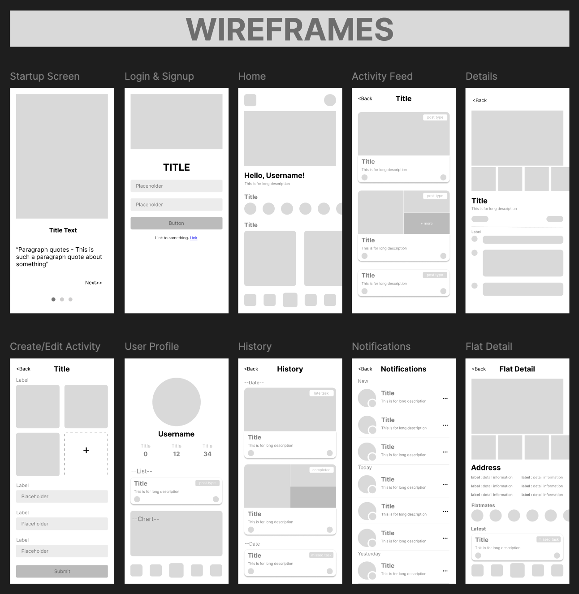
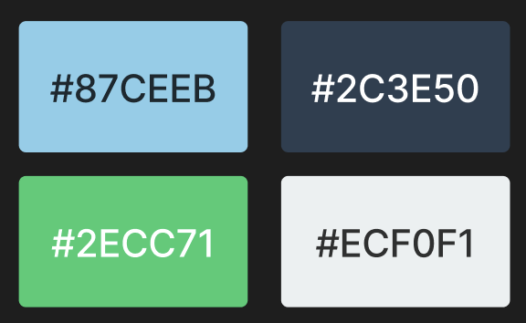

# Flat Sync

<p align="center">Flat Sync – Syncing the lives of flatmates in harmony.</p>
<p align="center">
  <a href="https://expo.dev" target="_blank"></a>
  <a href="https://reactnative.dev" target="_blank"></a>

</p>

---

## Table of Contents

- [Overview](#overview)
- [Features](#features)
- [Tech Stacks](#tech-stacks)
- [Getting Started](#getting-started)
- [Design & Prototypes](#design--prototypes)
- [Color Palette](#color-palette)

---

## Overview

**Flat Sync** is a unified system designed to seamlessly coordinate household responsibilities among flatmates. From managing cleaning schedules and trash disposal to handling rent payments, Flat Sync fosters collaboration and accountability, ensuring that life as a flatmate is both harmonious and efficient.

- **Version:** 1.0.0  
- **Development Start Date:** February 10

---

## Features

- **Flat/User Management:** Efficiently manage flatmate profiles and roles.
- **Task/Chore Scheduling:** Organize and schedule household tasks and chores.
- **Incident Reporting System:** Easily report and track incidents.
- **Financial Management:** Coordinate and manage shared expenses like rent and utilities.

---

## Tech Stacks

- **Framework:** React Native
- **Development Platform:** Expo

Flat Sync is built with modern technologies to ensure a smooth, native-like experience across mobile devices.

---

## Getting Started

Follow these steps to get your development environment set up:

1. **Clone the Repository**

	```bash
	 git clone https://github.com/yourusername/flatsync-mobile.git
	 cd flatsync-mobile
	```

2.  **Install Dependencies**
    
    Use either npm or yarn:
    
    ```bash
    npm install
    # or
    yarn install
    ```
    
3.  **Run the Project**
    
    Start the Expo development server:
    
    ```bash
    npm run start
    ```
    
    You can also run on a specific platform:
    
    -   **Android:** `npm run android`
    -   **iOS:** `npm run ios`
    -   **Web:** `npm run web`

----------

## Design & Prototypes

**Wireframes:** 

**Prototype:** https://www.figma.com/proto/iN0IdDQdUBO1ZIUyVAYGRE/FlatSync?node-id=20-274&t=XGk7eCHUZwSyZ7SY-1&scaling=scale-down&content-scaling=fixed&page-id=0%3A1&starting-point-node-id=20%3A274

----------

## Color Palette

The **Serene Blues** palette is chosen to convey reliability, calmness, and balance:

-   **Primary:** Soft Sky Blue `#87CEEB`
-   **Secondary:** Deep Navy `#2C3E50`
-   **Accent:** Seafoam Green `#2ECC71`
-   **Neutral:** Light Gray `#ECF0F1`
